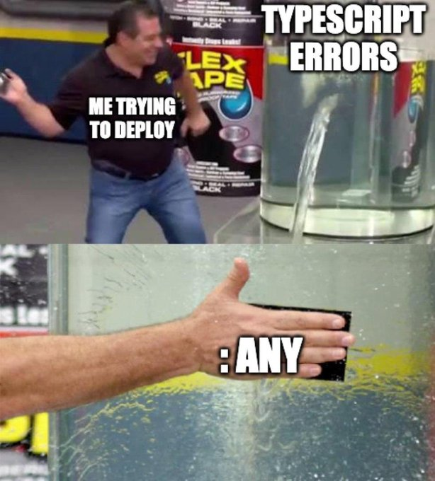

# No Bullshit Guide to Typescript for MIMUW student

Witaj! Czy zawsze chciałeś nauczyć się TypeScripta? A może chcesz stworzyć własną stronę internetową ze śmiesznymi kotkami? Albo po prostu musisz napisać zadanie zaliczeniowe na AWWW? W takim razie jest to poradnik dla Ciebie.


## Czym jest TypeScript?
TypeScript to nadzbiór JavaScriptu, który dodaje statyczne typowanie. Dzięki temu łatwiej unikać błędów w kodzie i pisać bardziej czytelne aplikacje.


## Po co to wszystko?
Warto używać TypeScripta z następujących powodów:

1. **Bezpieczeństwo typów**: Dzięki statycznemu typowaniu łatwiej unikać błędów w kodzie, które mogą pojawić się w czasie działania aplikacji.
2. **Lepsza czytelność kodu**: Typy jasno określają, co dana funkcja lub zmienna robi, co ułatwia zrozumienie kodu.
3. **Wsparcie dla dużych projektów**: TypeScript pomaga zarządzać złożonym kodem dzięki interfejsom, typom i modułom.
4. **Lepsze wsparcie IDE**: Dzięki TypeScriptowi edytory kodu, takie jak Visual Studio Code, oferują lepsze podpowiedzi, autouzupełnianie i wykrywanie błędów.
5. **Kompatybilność z JavaScriptem**: TypeScript jest nadzbiorem JavaScriptu, więc możesz używać istniejącego kodu JS i stopniowo migrować do TS.
6. **Łatwiejsze debugowanie**: Błędy są wykrywane na etapie kompilacji, co pozwala zaoszczędzić czas podczas testowania aplikacji.

TypeScript to narzędzie, które sprawia, że kod jest bardziej niezawodny, czytelny i łatwiejszy w utrzymaniu, szczególnie w większych projektach.

### Ale dlaczego nie mogę korzystać z samego html?

Możesz. Jeśli chcesz, żeby twoja strona wyglądała jak blog kulinarny z lat dziewięćdziesiątych prowadzony przez ciocię Gienię.

### Po co nadbudowywać JavaScript?

JavaScript jest świetnym językiem, ale ma swoje ograniczenia, które TypeScript stara się rozwiązać. Oto główne różnice i powody, dla których warto nadbudowywać JavaScript:

1. **Statyczne typowanie**:
   - **JavaScript**: Nie wymaga deklarowania typów, co może prowadzić do błędów w czasie działania.
   - **TypeScript**: Wprowadza statyczne typowanie, dzięki czemu błędy są wykrywane już na etapie kompilacji.

2. **Lepsza czytelność i utrzymanie kodu**:
   - **JavaScript**: W dużych projektach kod może stać się trudny do zrozumienia i utrzymania.
   - **TypeScript**: Dzięki typom, interfejsom i modułom kod jest bardziej przejrzysty i łatwiejszy w zarządzaniu.

3. **Wsparcie dla nowoczesnych funkcji**:
   - **JavaScript**: Wprowadza nowe funkcje w ramach standardu ECMAScript, ale ich wsparcie w przeglądarkach może być ograniczone.
   - **TypeScript**: Pozwala korzystać z najnowszych funkcji ECMAScript, kompilując je do starszych wersji JavaScriptu, które działają w każdej przeglądarce.

4. **Lepsze wsparcie IDE**:
   - **JavaScript**: IDE oferuje podstawowe podpowiedzi i autouzupełnianie.
   - **TypeScript**: Dzięki typom IDE może dostarczać bardziej precyzyjne podpowiedzi, co przyspiesza pisanie kodu i zmniejsza liczbę błędów.

5. **Debugowanie i testowanie**:
   - **JavaScript**: Błędy są często wykrywane dopiero w czasie działania aplikacji.
   - **TypeScript**: Wykrywa błędy na etapie kompilacji, co pozwala zaoszczędzić czas podczas debugowania.

6. **Skalowalność**:
   - **JavaScript**: W dużych projektach może być trudny do zarządzania.
   - **TypeScript**: Dzięki typom i strukturze lepiej nadaje się do dużych, złożonych aplikacji.

Podsumowując, TypeScript to JavaScript z dodatkowymi funkcjami, które sprawiają, że kod jest bardziej niezawodny, czytelny i łatwiejszy w utrzymaniu. Jeśli pracujesz nad większym projektem lub chcesz uniknąć typowych błędów JavaScriptu, TypeScript jest świetnym wyborem.


### No dobrze, ale jak tego wszystkiego się używa?

Postaram się odpowiedzieć na to ważne pytanie.


## Instalacja typescripta

Aby zainstalować TypeScript, wykonaj poniższe kroki:

1. **Zainstaluj Node.js**

TypeScript wymaga Node.js, aby działać. Jeśli nie masz Node.js, pobierz i zainstaluj go z [oficjalnej strony](https://nodejs.org/).

Po instalacji sprawdź, czy Node.js działa, wpisując w terminalu:
```bash
node --version
```

2. **Zainstaluj npm (Node Package Manager)**

Npm jest instalowany razem z Node.js. Sprawdź jego wersję:
```bash
npm --version
```

3. **Zainstaluj TypeScript globalnie**

Użyj npm, aby zainstalować TypeScript globalnie:
```bash
npm install -g typescript
```

4. **Sprawdź instalację TypeScript**

Po instalacji upewnij się, że TypeScript działa, wpisując:
```bash
tsc --version
```
Powinieneś zobaczyć wersję TypeScript.

5. **Utwórz pierwszy plik TypeScript**

Stwórz plik hello.ts:

```typescript
const greet = (name: string): string => {
    return `Hello, ${name}!`;
};

console.log(greet("MIMUW"));
```

Skompiluj plik do JavaScript:
```bash
tsc hello.ts
```
Powstanie plik hello.js.

Uruchom plik JavaScript:
```bash
node hello.js
```

Jeśli chcesz uruchamiać pliki TypeScript bez potrzeby kompilacji, zainstaluj ts-node:
```bash
npm install -g ts-node
```
Uruchom plik TypeScript bezpośrednio:
```bash
ts-node hello.ts
```

Gratulacje! Właśnie powstał twój pierwszy program w TS. Spójrzmy może teraz na strukturę samego języka.

## Podstawy składni

### Typy podstawowe

TypeScript wprowadza statyczne typowanie, co oznacza, że każda zmienna musi mieć określony typ. Oto podstawowe typy dostępne w TypeScript:

```typescript
let liczba: number = 42; // Liczby całkowite i zmiennoprzecinkowe
let duzaLiczba: bigint = 9007199254740991n;
let tekst: string = "Hello, MIMUW!";
let prawda: boolean = true;
let pusta: null = null;
let niezdefiniowana: undefined = undefined;

// Typ uniwersalny pozwala na nadanie dowolnej wartości:
let dowolny: any = 42;
dowolny = "tekst";

// Typ void używany w funkcjach, które nie zwracają wartości:
function loguj(): void {
    console.log("To jest funkcja bez zwracanej wartości.");
}

// Typ never dla funkcji, które nigdy nie zwracają (np. rzucają wyjątki lub mają nieskończoną pętlę):
function rzucBlad(): never {
    throw new Error("To jest błąd!");
}

// Typ dla obiektów. O obiektach powiemy niżej w osobnej sekcji.
let osoba: object = { imie: "Jan", wiek: 21 };

// Typ symbol - używany dla unikalnych wartości:
let symbolUnikalny: symbol = Symbol("unikalny");
// Na przykład:
let symbol1 = Symbol("opis");
let symbol2 = Symbol("opis");
console.log(symbol1 === symbol2); // false

let symbol = Symbol("opis");
console.log(symbol.description); // "opis"
```




### Tablice
Tablice w TypeScript to struktury danych, które pozwalają przechowywać wiele wartości tego samego typu w jednej zmiennej. Dzięki statycznemu typowaniu możemy określić, jakie typy danych mogą znajdować się w tablicy, co zwiększa bezpieczeństwo i czytelność kodu.

#### Deklaracja tablicy

W TypeScript istnieją dwa sposoby deklarowania tablic:
**Za pomocą nawiasów kwadratowych (`[]`):**
   ```typescript
   let liczby: number[] = [1, 2, 3, 4, 5]; // Tablica liczb
   let teksty: string[] = ["A", "B", "C"]; // Tablica tekstów
   ```
**Za pomocą generyków (Array<typ>):**
   ```typescript
   let liczby: Array<number> = [1, 2, 3, 4, 5]; // Tablica liczb
   let teksty: Array<string> = ["A", "B", "C"]; // Tablica tekstów
   ```

#### Operacje na tablicach
TypeScript dziedziczy wszystkie metody tablic z JavaScriptu, co pozwala na wykonywanie różnych operacji na danych.

```typescript
// Dodawanie elementu:
let liczby: number[] = [1, 2, 3];
liczby.push(4); // Dodaje element na końcu tablicy
console.log(liczby); // [1, 2, 3, 4]

// Usuwanie elementu:
liczby.pop(); // Usuwa ostatni element tablicy
console.log(liczby); // [1, 2, 3]

// Dostęp do elementów:
console.log(liczby[0]); // 1 (pierwszy element tablicy)

// Iterowanie po tablicy:
liczby.forEach((liczba) => {
    console.log(liczba); // Wyświetla każdy element tablicy
});

// Mapowanie tablicy:
let podwojone: number[] = liczby.map((liczba) => liczba * 2);
console.log(podwojone); // [2, 4, 6]

// Filtrowanie tablicy:
let parzyste: number[] = liczby.filter((liczba) => liczba % 2 === 0);
console.log(parzyste); // [2]
```
#### Tablice wielowymiarowe
TypeScript obsługuje również tablice wielowymiarowe, które są tablicami zawierającymi inne tablice.

```typescript
let macierz: number[][] = [
    [1, 2, 3],
    [4, 5, 6],
    [7, 8, 9],
];
console.log(macierz[1][2]); // 6 (element z drugiego wiersza i trzeciej kolumny)
```

#### Typowanie tablic mieszanych
Jeśli tablica może zawierać różne typy danych, możemy użyć unii typów:
```typescript
let mieszana: (number | string)[] = [1, "tekst", 2, "kolejny tekst"];
console.log(mieszana); // [1, "tekst", 2, "kolejny tekst"]
```


### Obiekty

Obiekty w TypeScript to struktury danych, które przechowują pary klucz-wartość. Klucze są nazwami właściwości, a wartości mogą mieć dowolny typ. Dzięki statycznemu typowaniu możemy precyzyjnie określić strukturę obiektu, co zwiększa bezpieczeństwo i czytelność kodu.

#### Tworzenie obiektów

Obiekt można zdefiniować za pomocą literału obiektowego `{}`:
```typescript
let osoba: { imie: string; wiek: number } = {
    imie: "Jan",
    wiek: 21,
};
```

#### Dostęp do właściwości
Do właściwości obiektu można uzyskać dostęp za pomocą notacji kropkowej lub nawiasów kwadratowych:
```typescript
console.log(osoba.imie); // "Jan"
console.log(osoba["wiek"]); // 21
```

#### Modyfikacja właściwości
Możemy zmieniać wartości właściwości obiektu:
```typescript
osoba.wiek = 22;
console.log(osoba.wiek); // 22
```

#### Opcjonalne właściwości
W TypeScript możemy oznaczyć właściwości jako opcjonalne, używając znaku zapytania (?):
```typescript
let student: { imie: string; wiek?: number } = {
    imie: "Anna",
};
console.log(student.wiek); // undefined
```

#### Typowanie obiektów za pomocą interfejsów
Aby uniknąć powtarzania struktury obiektu, możemy użyć interfejsów:
```typescript
interface Osoba {
    imie: string;
    wiek: number;
}

let pracownik: Osoba = {
    imie: "Kasia",
    wiek: 30,
};
```

#### Obiekty z dowolnymi właściwościami
Jeśli obiekt może mieć dowolną liczbę właściwości, możemy użyć indeksowania:
```typescript
let konfiguracja: { [klucz: string]: string } = {
    host: "localhost",
    port: "8080",
};
console.log(konfiguracja["host"]); // "localhost"
```

#### Obiekty z funkcjami
Obiekty mogą zawierać funkcje jako swoje właściwości:
```typescript
let kalkulator: { dodaj: (a: number, b: number) => number } = {
    dodaj: (a, b) => a + b,
};
console.log(kalkulator.dodaj(2, 3)); // 5
```

#### Tablice obiektów
Możemy również tworzyć tablice, które przechowują obiekty:
```typescript
let osoby: Osoba[] = [
    { imie: "Jan", wiek: 21 },
    { imie: "Anna", wiek: 23 },
];
```

#### Iterowanie po tablicy obiektów:
```typescript
osoby.forEach((osoba) => {
    console.log(`${osoba.imie} ma ${osoba.wiek} lat.`);
});
```


### Funkcje

Funkcje w TypeScript są podstawowym elementem języka, który pozwala na organizowanie kodu w modułowe i wielokrotnego użytku bloki. Dzięki statycznemu typowaniu możemy precyzyjnie określić typy parametrów oraz typ zwracanej wartości, co zwiększa bezpieczeństwo i czytelność kodu.

#### Deklaracja funkcji

Funkcję można zadeklarować za pomocą słowa kluczowego `function`:
```typescript
function dodaj(a: number, b: number): number {
    return a + b;
}
console.log(dodaj(2, 3)); // 5
```

#### Funkcje anonimowe
Funkcje anonimowe to funkcje bez nazwy, które można przypisać do zmiennej:
```typescript
const odejmij = function (a: number, b: number): number {
    return a - b;
};
console.log(odejmij(5, 3)); // 2
```


#### Funkcje strzałkowe
Funkcje strzałkowe to skrócona składnia funkcji anonimowych:
```typescript
const pomnoz = (a: number, b: number): number => a * b;
console.log(pomnoz(4, 5)); // 20
```


#### Parametry opcjonalne
W TypeScript możemy oznaczyć parametry jako opcjonalne, używając znaku zapytania (?):
```typescript
function przywitaj(imie: string, wiek?: number): string {
    if (wiek) {
        return `Cześć, ${imie}! Masz ${wiek} lat.`;
    }
    return `Cześć, ${imie}!`;
}
console.log(przywitaj("Jan")); // "Cześć, Jan!"
console.log(przywitaj("Anna", 25)); // "Cześć, Anna! Masz 25 lat."
```


#### Parametry domyślne
Możemy również ustawić wartości domyślne dla parametrów:
```typescript
function powitaj(imie: string = "Gość"): string {
    return `Witaj, ${imie}!`;
}
console.log(powitaj()); // "Witaj, Gość!"
console.log(powitaj("MIMUW")); // "Witaj, MIMUW!"
```


#### Parametry rest (rest parameters)
Funkcje mogą przyjmować dowolną liczbę argumentów za pomocą parametrów rest:
```typescript
function suma(...liczby: number[]): number {
    return liczby.reduce((a, b) => a + b, 0);
}
console.log(suma(1, 2, 3, 4)); // 10
```


#### Typ funkcji
W TypeScript możemy określić typ funkcji, definiując typy parametrów i zwracanej wartości:
```typescript
let operacja: (a: number, b: number) => number;

operacja = (a, b) => a + b;
console.log(operacja(3, 7)); // 10
```


#### Funkcje zwracające void
Funkcje, które nic nie zwracają, mają typ void:
```typescript
function logujWiadomosc(wiadomosc: string): void {
    console.log(wiadomosc);
}
logujWiadomosc("To jest wiadomość."); // "To jest wiadomość."
```


#### Funkcje zwracające never
Funkcje, które nigdy nie zwracają wartości (np. rzucają wyjątki lub mają nieskończoną pętlę), mają typ never:
```typescript
function rzucBlad(wiadomosc: string): never {
    throw new Error(wiadomosc);
}
```


#### Funkcje przeciążone (overloading)
TypeScript obsługuje przeciążanie funkcji, co pozwala na definiowanie wielu sygnatur dla jednej funkcji:
```typescript
function polacz(a: string, b: string): string;
function polacz(a: number, b: number): number;
function polacz(a: any, b: any): any {
    return a + b;
}

console.log(polacz(1, 2)); // 3
console.log(polacz("Hello, ", "World!")); // "Hello, World!"
```

## Słowa kluczowe

### var

Słowo kluczowe `var` jest jednym z trzech sposobów deklarowania zmiennych w JavaScript i TypeScript. Jest to starsza metoda, która była używana przed wprowadzeniem `let` i `const` w standardzie ECMAScript 6 (ES6). Chociaż `var` nadal działa, jego użycie jest odradzane ze względu na kilka potencjalnych pułapek.

#### Deklaracja zmiennej za pomocą `var`
```typescript
var liczba = 10;
console.log(liczba); // 10
```

#### Cechy Var:

**Zakres funkcji (function scope)**

Zmienne zadeklarowane za pomocą var mają zakres ograniczony do funkcji, w której zostały zadeklarowane. Nie są ograniczone blokiem kodu (np. w pętli lub instrukcji warunkowej). Na przykład:
```typescript
function testVar() {
    if (true) {
        var x = 5;
    }
    console.log(x); // 5 (zmienna jest dostępna poza blokiem if)
}
testVar();
```

**Hoisting (podnoszenie)**

Zmienne zadeklarowane za pomocą var są "podnoszone" na początek zakresu, co oznacza, że można ich używać przed faktyczną deklaracją. Jednak ich wartość będzie undefined, dopóki nie zostanie przypisana.
```typescript
console.log(a); // undefined (zmienna została podniesiona, ale nie przypisano wartości)
var a = 10;
```

**Brak ochrony przed wielokrotną deklaracją**

Zmienne zadeklarowane za pomocą var mogą być wielokrotnie deklarowane w tym samym zakresie, co może prowadzić do nieoczekiwanych błędów.
```typescript
var liczba = 10;
var liczba = 20; // Nie powoduje błędu
console.log(liczba); // 20
```

**Dostępność w globalnym zakresie**

Jeśli var zostanie zadeklarowane poza funkcją, stanie się właściwością obiektu globalnego (window w przeglądarce lub global w Node.js).
```typescript
var globalVar = "Jestem globalny!";
console.log(window.globalVar); // "Jestem globalny!" (w przeglądarce)
```

#### Pułapki i błędy związane z var

**Nieprzewidywalne zachowanie w pętlach**

Ponieważ var nie ma zakresu blokowego, zmienne w pętlach mogą zachowywać się nieoczekiwanie.
```typescript
for (var i = 0; i < 3; i++) {
    setTimeout(() => console.log(i), 1000);
}
// Wynik: 3, 3, 3 (zmienna `i` jest współdzielona w całej pętli)
```

Rozwiązanie: Użyj let, który ma zakres blokowy:
```typescript
for (let i = 0; i < 3; i++) {
    setTimeout(() => console.log(i), 1000);
}
// Wynik: 0, 1, 2
```

Hoisting może prowadzić do błędów, jeśli zmienna jest używana przed przypisaniem wartości.
```typescript
console.log(x); // undefined
var x = 5;
```

Deklarowanie zmiennych za pomocą var w globalnym zakresie może prowadzić do konfliktów nazw i trudnych do debugowania błędów.
```typescript
var x = 10;
function test() {
    var x = 20;
    console.log(x); // 20
}
test();
console.log(x); // 10
```

#### Dlaczego unikać var?
let i const wprowadzone w ES6 rozwiązują większość problemów związanych z var:
- Mają zakres blokowy.
- Nie pozwalają na wielokrotną deklarację w tym samym zakresie.
- const zapewnia niezmienność zmiennych.


### let

Słowo kluczowe `let` zostało wprowadzone w standardzie ECMAScript 6 (ES6) jako nowoczesny sposób deklarowania zmiennych. W przeciwieństwie do `var`, `let` rozwiązuje wiele problemów związanych z zakresem i hoistingiem, co czyni go bardziej bezpiecznym i przewidywalnym w użyciu.

#### Deklaracja zmiennej za pomocą `let`
```typescript
let liczba = 10;
console.log(liczba); // 10
```

#### Cechy let

**Zakres blokowy (block scope)**

Zmienne zadeklarowane za pomocą let mają zakres ograniczony do bloku, w którym zostały zadeklarowane (np. w pętli, instrukcji warunkowej lub funkcji). Jest to główna różnica w porównaniu do var.
```typescript
if (true) {
    let x = 5;
    console.log(x); // 5
}
console.log(x); // Błąd: x is not defined
```
**Brak wielokrotnej deklaracji w tym samym zakresie**

W przeciwieństwie do var, let nie pozwala na wielokrotną deklarację tej samej zmiennej w tym samym zakresie.
```typescript
let liczba = 10;
let liczba = 20; // Błąd: Identifier 'liczba' has already been declared
```

**Hoisting**

Podobnie jak var, zmienne zadeklarowane za pomocą let są "podnoszone" na początek zakresu. Jednak w przeciwieństwie do var, nie można ich używać przed faktyczną deklaracją. Jest to znane jako "Temporal Dead Zone" (TDZ).
```typescript
console.log(a); // Błąd: Cannot access 'a' before initialization
let a = 10;
```

**Lepsze wsparcie dla pętli**

let rozwiązuje problem z zakresem zmiennych w pętlach, który występował przy użyciu var. Każda iteracja pętli ma swój własny zakres zmiennej.

```typescript
for (let i = 0; i < 3; i++) {
    setTimeout(() => console.log(i), 1000);
}
// Wynik: 0, 1, 2
```

#### Pułapki i błędy związane z let

**Temporal Dead Zone (TDZ)**

Zmienna zadeklarowana za pomocą let jest w "strefie czasowej niedostępności" od początku zakresu, w którym została zadeklarowana, aż do momentu jej inicjalizacji. Próba dostępu do zmiennej w tej strefie powoduje błąd.
```typescript
console.log(x); // Błąd: Cannot access 'x' before initialization
let x = 5;
```

#### Kiedy używać let?
- Gdy zmienna będzie zmieniać swoją wartość w trakcie działania programu.
- Gdy potrzebujesz zmiennej o zakresie blokowym (np. w pętlach lub instrukcjach warunkowych).
- Gdy chcesz uniknąć problemów związanych z var, takich jak hoisting czy brak zakresu blokowego.


### const

Słowo kluczowe `const` zostało wprowadzone w standardzie ECMAScript 6 (ES6) jako sposób deklarowania zmiennych, których wartość nie może być ponownie przypisana. Jest to najbardziej restrykcyjny sposób deklarowania zmiennych w JavaScript i TypeScript, co czyni go idealnym do definiowania stałych lub wartości, które nie powinny się zmieniać.

#### Deklaracja zmiennej za pomocą `const`
```typescript
const liczba = 10;
console.log(liczba); // 10
```

**Brak możliwości ponownego przypisania wartości**

Zmienna zadeklarowana za pomocą const nie może być ponownie przypisana. Próba przypisania nowej wartości spowoduje błąd.
```typescript
const liczba = 10;
liczba = 20; // Błąd: Assignment to constant variable.
```
**Stałość odniesienia, a nie zawartości**

W przypadku obiektów i tablic const chroni jedynie odniesienie (referencję), a nie zawartość. Oznacza to, że można modyfikować właściwości obiektu lub elementy tablicy, ale nie można przypisać nowej wartości do zmiennej.
```typescript
const osoba = { imie: "Jan", wiek: 21 };
osoba.wiek = 22; // Dozwolone
console.log(osoba); // { imie: "Jan", wiek: 22 }

osoba = { imie: "Anna", wiek: 25 }; // Błąd: Assignment to constant variable.
```

Przykład z tablicą:
```typescript
const liczby = [1, 2, 3];
liczby.push(4); // Dozwolone
console.log(liczby); // [1, 2, 3, 4]

liczby = [5, 6, 7]; // Błąd: Assignment to constant variable.
```

#### Porównanie const, let i var:

| Cecha                  | `var`                         | `let`                         | `const`                       |
|------------------------|-------------------------------|-------------------------------|-------------------------------|
| Zakres                 | Funkcyjny (function scope)    | Blokowy (block scope)         | Blokowy (block scope)         |
| Wielokrotna deklaracja | Dozwolona                     | Niedozwolona                  | Niedozwolona                  |
| Hoisting               | Tak, z wartością `undefined`  | Tak, ale w TDZ                | Tak, ale w TDZ                |
| Możliwość przypisania  | Tak                           | Tak                           | Tylko raz                     |
| Modyfikacja zawartości | Tak                           | Tak                           | Tak (dla obiektów i tablic)   |

### this

Słowo kluczowe `this` w TypeScript (i JavaScript) odnosi się do kontekstu, w którym aktualnie wykonywany jest kod. Wartość `this` zależy od sposobu wywołania funkcji, co może prowadzić do nieoczekiwanych zachowań, jeśli nie jest odpowiednio zrozumiane.

#### Wartość `this` w różnych kontekstach

1. **W globalnym kontekście**
   W globalnym zakresie `this` odnosi się do obiektu globalnego (`window` w przeglądarce lub `global` w Node.js).

   **Przykład:**
   ```typescript
   console.log(this); // W przeglądarce: obiekt `window`
   ```
2. **W metodach obiektów**
   W metodzie obiektu `this` odnosi się do obiektu, który wywołał metodę.
   ```typescript
   const osoba = {
    imie: "Jan",
    przywitaj() {
        console.log(`Cześć, ${this.imie}!`);
    },
   };
   osoba.przywitaj(); // "Cześć, Jan!"
   ```
3. **W funkcjach**
   W zwykłych funkcjach this odnosi się do obiektu globalnego (w trybie ścisłym undefined).
   ```typescript
   function pokazThis() {
      console.log(this);
   }
   pokazThis(); // W przeglądarce: obiekt `window`, w trybie ścisłym: `undefined`
   ```
4. **W funkcjach strzałkowych**
   Funkcje strzałkowe nie mają własnego this. Zamiast tego dziedziczą this z otaczającego kontekstu.
   ```typescript
   const osoba = {
      imie: "Anna",
      przywitaj: () => {
         console.log(`Cześć, ${this.imie}!`);
      },
   };
   osoba.przywitaj(); // "Cześć, undefined!" (dziedziczy `this` z kontekstu globalnego)
   ```
5. **W klasach**
   W klasach this odnosi się do instancji klasy.
   ```typescript
   class Osoba {
      imie: string;

      constructor(imie: string) {
         this.imie = imie;
      }

      przywitaj() {
         console.log(`Cześć, ${this.imie}!`);
      }
   }

   const jan = new Osoba("Jan");
   jan.przywitaj(); // "Cześć, Jan!"
   ```

#### Pułapki związane z this

**Utrata kontekstu**

Wartość this może zostać utracona, gdy metoda obiektu jest przypisana do zmiennej lub przekazana jako argument.
```typescript
const osoba = {
    imie: "Jan",
    przywitaj() {
        console.log(`Cześć, ${this.imie}!`);
    },
};

const przywitaj = osoba.przywitaj;
przywitaj(); // "Cześć, undefined!" (utrata kontekstu)
```

Rozwiązanie: Użyj funkcji strzałkowej lub metody bind:
```typescript
const przywitajPoprawnie = osoba.przywitaj.bind(osoba);
przywitajPoprawnie(); // "Cześć, Jan!"
```

**this w funkcjach strzałkowych**

Funkcje strzałkowe dziedziczą this z otaczającego kontekstu, co może prowadzić do nieoczekiwanych wyników, jeśli są używane w metodach obiektów.
```typescript
const osoba = {
    imie: "Anna",
    przywitaj: () => {
        console.log(`Cześć, ${this.imie}!`);
    },
};
osoba.przywitaj(); // "Cześć, undefined!"
```

**this w callbackach**

Wartość this w callbackach może być inna niż oczekiwana.
```typescript
const osoba = {
    imie: "Jan",
    przywitaj() {
        setTimeout(function () {
            console.log(`Cześć, ${this.imie}!`);
        }, 1000);
    },
};
osoba.przywitaj(); // "Cześć, undefined!" (utrata kontekstu)
```

Rozwiązanie: Użyj funkcji strzałkowej:
```typescript
const osoba = {
    imie: "Jan",
    przywitaj() {
        setTimeout(() => {
            console.log(`Cześć, ${this.imie}!`);
        }, 1000);
    },
};
osoba.przywitaj(); // "Cześć, Jan!"
```

Mem kradziony z wykładu:


### as

Słowo kluczowe `as` w TypeScript służy do rzutowania (castowania) typów. Pozwala programiście poinformować kompilator, że dana wartość ma określony typ, nawet jeśli TypeScript nie jest w stanie tego samodzielnie wywnioskować. Jest to szczególnie przydatne w sytuacjach, gdy pracujemy z dynamicznymi danymi, takimi jak dane z API, lub gdy chcemy nadpisać domyślną inferencję typów.

#### Składnia
```typescript
wartość as Typ
```

Przykłady:
Rzutowanie na konkretny typ:
```typescript
let wartość: any = "Hello, MIMUW!";
let długość: number = (wartość as string).length;
console.log(długość); // 13
```

Rzutowanie na bardziej szczegółowy typ Jeśli mamy bardziej ogólny typ, możemy rzutować go na bardziej szczegółowy:
```typescript
type Zwierzę = { imie: string };
type Pies = { imie: string; rasa: string };

let zwierzę: Zwierzę = { imie: "Burek" };
let pies = zwierzę as Pies;
pies.rasa = "Owczarek";
console.log(pies); // { imie: "Burek", rasa: "Owczarek" }
```

Rzutowanie w przypadku dynamicznych danych Przy pracy z danymi zewnętrznymi, np. z API, możemy użyć as, aby poinformować TypeScript o typie danych:
```typescript
const dane: any = { id: 1, nazwa: "Produkt" };
const produkt = dane as { id: number; nazwa: string };
console.log(produkt.nazwa); // "Produkt"
```

Rzutowanie na unknown Jeśli mamy zmienną typu unknown, musimy użyć as, aby określić jej typ przed użyciem:
```typescript
let wartość: unknown = "To jest tekst";
let długość: number = (wartość as string).length;
console.log(długość); // 14
```

#### Pułapki i błędy związane z as

**Nieprawidłowe rzutowanie**

TypeScript nie sprawdza w czasie działania, czy rzutowanie jest poprawne. Jeśli rzutujemy na niewłaściwy typ, możemy napotkać błędy w czasie działania:
```typescript
let wartość: any = 42;
let tekst = wartość as string;
console.log(tekst.length); // Błąd w czasie działania: Cannot read property 'length' of number
```

**Nadmierne użycie as**

Nadmierne poleganie na as może prowadzić do ignorowania błędów typów, co osłabia zalety TypeScript. Zawsze warto unikać rzutowania, jeśli TypeScript jest w stanie samodzielnie wywnioskować typy.

**Rzutowanie na niezgodne typy**

TypeScript pozwala na rzutowanie między niezgodnymi typami, co może prowadzić do nieoczekiwanych błędów:
```typescript
let liczba: number = 123;
let obiekt = liczba as unknown as { imie: string };
console.log(obiekt.imie); // Błąd w czasie działania: undefined
```

#### Kiedy używać as?
- Gdy TypeScript nie jest w stanie samodzielnie wywnioskować typu.
- Gdy pracujesz z dynamicznymi danymi, np. z API.
- Gdy chcesz rzutować na bardziej szczegółowy typ.


## Interfejsy

Interfejsy w TypeScript służą do definiowania kontraktów dla obiektów, klas lub funkcji. Pozwalają na precyzyjne określenie struktury danych, co zwiększa czytelność i bezpieczeństwo kodu. Interfejsy są jednym z najważniejszych narzędzi w TypeScript, szczególnie w dużych projektach.

#### Tworzenie interfejsu

Interfejs definiuje strukturę obiektu, określając jego właściwości i ich typy:
```typescript
interface Osoba {
    imie: string;
    wiek: number;
}

let student: Osoba = {
    imie: "Jan",
    wiek: 21,
};
```

#### Opcjonalne właściwości
Właściwości w interfejsie mogą być opcjonalne, co oznacza, że nie muszą być obecne w obiekcie:
```typescript
interface Osoba {
    imie: string;
    wiek?: number; // Opcjonalna właściwość
}

let student: Osoba = {
    imie: "Anna",
};
```

#### Właściwości tylko do odczytu
Możemy oznaczyć właściwości jako tylko do odczytu, co oznacza, że ich wartość nie może być zmieniona po przypisaniu:
```typescript
interface Punkt {
    readonly x: number;
    readonly y: number;
}

let punkt: Punkt = { x: 10, y: 20 };
punkt.x = 15; // Błąd: Cannot assign to 'x' because it is a read-only property
```

#### Indeksowanie
Interfejsy mogą definiować obiekty z dynamicznymi kluczami za pomocą indeksowania:
```typescript
interface Slownik {
    [klucz: string]: string;
}

let tlumaczenia: Slownik = {
    hello: "cześć",
    world: "świat",
};
console.log(tlumaczenia["hello"]); // "cześć"
```

#### Funkcje w interfejsach
Interfejsy mogą definiować funkcje jako właściwości:
```typescript
interface Kalkulator {
    dodaj(a: number, b: number): number;
    odejmij(a: number, b: number): number;
}

let kalkulator: Kalkulator = {
    dodaj: (a, b) => a + b,
    odejmij: (a, b) => a - b,
};

console.log(kalkulator.dodaj(5, 3)); // 8
console.log(kalkulator.odejmij(5, 3)); // 2
```

#### Dziedziczenie interfejsów
Interfejsy mogą dziedziczyć od innych interfejsów, co pozwala na ich rozszerzanie:
```typescript
interface Zwierze {
    imie: string;
}

interface Pies extends Zwierze {
    rasa: string;
}

let mojPies: Pies = {
    imie: "Burek",
    rasa: "Owczarek",
};
```

#### Łączenie deklaracji interfejsów
TypeScript pozwala na łączenie deklaracji interfejsów o tej samej nazwie:
```typescript
interface Uzytkownik {
    imie: string;
}

interface Uzytkownik {
    wiek: number;
}

let uzytkownik: Uzytkownik = {
    imie: "Jan",
    wiek: 30,
};
```

#### Interfejsy a typy
Interfejsy są podobne do typów (type), ale mają kilka różnic:

- Interfejsy mogą być rozszerzane za pomocą extends, podczas gdy typy można łączyć za pomocą operatora &.
- Interfejsy są bardziej zorientowane na obiekty, podczas gdy typy są bardziej uniwersalne (mogą reprezentować np. unie typów).
Przykład z typem:
```typescript
type Osoba = {
    imie: string;
    wiek: number;
};

let student: Osoba = {
    imie: "Anna",
    wiek: 22,
};
```

### Pułapki i <vscode_annotation
#### Brak zgodności z interfejsem
Jeśli obiekt nie spełnia wymagań interfejsu, TypeScript zgłosi błąd:
```typescript
interface Osoba {
    imie: string;
    wiek: number;
}

let student: Osoba = {
    imie: "Jan",
}; // Błąd: Property 'wiek' is missing
```

#### Nadmierna zgodność
TypeScript wymaga, aby obiekt miał dokładnie te właściwości, które są określone w interfejsie. Dodatkowe właściwości mogą powodować błędy:
```typescript
interface Osoba {
    imie: string;
}

let student: Osoba = {
    imie: "Jan",
    wiek: 21, // Błąd: Object literal may only specify known properties
};
```

Rozwiązanie: Użyj operatora rzutowania (as) lub przypisz obiekt do zmiennej przed użyciem:
```typescript
let student = {
    imie: "Jan",
    wiek: 21,
};
let osoba: Osoba = student; // Dozwolone
```

#### Niejasne typowanie dynamicznych kluczy
Jeśli używasz indeksowania w interfejsach, upewnij się, że typ klucza i wartości są odpowiednio zdefiniowane. Błędy mogą pojawić się, gdy klucz lub wartość nie pasują do zadeklarowanego typu:
```typescript
interface Slownik {
    [klucz: string]: string;
}

let tlumaczenia: Slownik = {
    hello: "cześć",
    liczba: 123, // Błąd: Type 'number' is not assignable to type 'string'
};
```


## Klasy i dziedziczenie w TypeScript

Klasy w TypeScript są rozszerzeniem klas w JavaScript, wprowadzonym w standardzie ECMAScript 6 (ES6). TypeScript dodaje do nich dodatkowe funkcje, takie jak typowanie, modyfikatory dostępu czy interfejsy, co czyni je bardziej użytecznymi i bezpiecznymi w dużych projektach.

#### Tworzenie klasy

Klasa to szablon do tworzenia obiektów. Definiuje właściwości i metody, które obiekty utworzone na jej podstawie będą posiadać.

**Przykład:**
```typescript
class Osoba {
    imie: string;
    wiek: number;

    constructor(imie: string, wiek: number) {
        this.imie = imie;
        this.wiek = wiek;
    }

    przywitaj(): void {
        console.log(`Cześć, mam na imię ${this.imie} i mam ${this.wiek} lat.`);
    }
}

const jan = new Osoba("Jan", 25);
jan.przywitaj(); // "Cześć, mam na imię Jan i mam 25 lat."
```
#### Modyfikatory dostępu
TypeScript wprowadza modyfikatory dostępu, które kontrolują widoczność właściwości i metod w klasach:

- public (domyślny) – Właściwości i metody są dostępne wszędzie.
- private – Właściwości i metody są dostępne tylko wewnątrz klasy.
- protected – Właściwości i metody są dostępne wewnątrz klasy i w klasach dziedziczących.

Przykład:

```typescript
class KontoBankowe {
    public numerKonta: string;
    private saldo: number;

    constructor(numerKonta: string, saldo: number) {
        this.numerKonta = numerKonta;
        this.saldo = saldo;
    }

    public sprawdzSaldo(): number {
        return this.saldo;
    }

    private zmienSaldo(kwota: number): void {
        this.saldo += kwota;
    }
}

const konto = new KontoBankowe("123456789", 1000);
console.log(konto.numerKonta); // "123456789"
console.log(konto.sprawdzSaldo()); // 1000
konto.zmienSaldo(500); // Błąd: metoda `zmienSaldo` jest prywatna
```

#### Dziedziczenie
Dziedziczenie pozwala jednej klasie (klasie pochodnej) przejąć właściwości i metody innej klasy (klasy bazowej).

Przykład:
```typescript
class Zwierze {
    imie: string;

    constructor(imie: string) {
        this.imie = imie;
    }

    przywitaj(): void {
        console.log(`Cześć, jestem ${this.imie}.`);
    }
}

class Pies extends Zwierze {
    rasa: string;

    constructor(imie: string, rasa: string) {
        super(imie); // Wywołanie konstruktora klasy bazowej
        this.rasa = rasa;
    }

    szczekaj(): void {
        console.log("Hau hau!");
    }
}

const burek = new Pies("Burek", "Owczarek");
burek.przywitaj(); // "Cześć, jestem Burek."
burek.szczekaj(); // "Hau hau!"
```

#### Nadpisywanie metod
Klasa pochodna może nadpisać metodę klasy bazowej, aby dostosować jej działanie.

Przykład:
```typescript
class Zwierze {
    przywitaj(): void {
        console.log("Cześć, jestem zwierzęciem.");
    }
}

class Kot extends Zwierze {
    przywitaj(): void {
        console.log("Miau, jestem kotem.");
    }
}

const kot = new Kot();
kot.przywitaj(); // "Miau, jestem kotem."
```

#### Klasy abstrakcyjne
Klasy abstrakcyjne to klasy, które nie mogą być instancjonowane. Służą jako szablony dla klas pochodnych. Mogą zawierać metody abstrakcyjne (bez implementacji), które muszą być zaimplementowane w klasach pochodnych.

Przykład:
```typescript
abstract class Zwierze {
    abstract wydajDzwiek(): void;

    przywitaj(): void {
        console.log("Cześć, jestem zwierzęciem.");
    }
}

class Pies extends Zwierze {
    wydajDzwiek(): void {
        console.log("Hau hau!");
    }
}

const pies = new Pies();
pies.przywitaj(); // "Cześć, jestem zwierzęciem."
pies.wydajDzwiek(); // "Hau hau!"
// const zwierze = new Zwierze(); // Błąd: nie można utworzyć instancji klasy abstrakcyjnej
```

#### Interfejsy a klasy
Klasy mogą implementować interfejsy, co oznacza, że muszą spełniać określony kontrakt (zawierać właściwości i metody zdefiniowane w interfejsie).

Przykład:
```typescript
interface Latajace {
    lec(): void;
}

class Samolot implements Latajace {
    lec(): void {
        console.log("Samolot leci.");
    }
}

const boeing = new Samolot();
boeing.lec(); // "Samolot leci."
```

### Pułapki i błędy związane z klasami
#### Brak inicjalizacji właściwości
TypeScript wymaga, aby wszystkie właściwości były zainicjalizowane w konstruktorze lub oznaczone jako opcjonalne.

Przykład:
```typescript
class Osoba {
    imie: string; // Błąd: właściwość 'imie' nie została zainicjalizowana
}
```

Rozwiązanie:
```typescript
class Osoba {
    imie: string = "Nieznane";
}
```

#### Nieprawidłowe użycie super
W klasach pochodnych należy wywołać super() przed dostępem do this.

Przykład:
```typescript
class Zwierze {
    constructor(public imie: string) {}
}

class Pies extends Zwierze {
    constructor(imie: string, public rasa: string) {
        // super(imie); // Błąd: brak wywołania `super`
        this.rasa = rasa; // Błąd: nie można użyć `this` przed `super()`
    }
}
```

#### Nadmierne użycie modyfikatora public
Właściwości i metody są domyślnie public, więc nie zawsze konieczne jest jawne ich oznaczanie.

## Dekoratory
Dekoratory w TypeScript to specjalne funkcje, które mogą być używane do modyfikowania klas, metod, właściwości lub parametrów. Są one częścią eksperymentalnej funkcjonalności TypeScript i wymagają włączenia odpowiedniej opcji w konfiguracji kompilatora.

#### Włączanie dekoratorów

Aby używać dekoratorów, należy włączyć opcję `experimentalDecorators` w pliku `tsconfig.json`:
```json
{
  "compilerOptions": {
    "experimentalDecorators": true
  }
}
```

### Rodzaje dekoratorów
#### Dekoratory klas
Dekoratory klas są wywoływane na poziomie klasy i mogą modyfikować lub zastępować definicję klasy.

Przykład:
```typescript
function ZalogujKlasę(cel: Function) {
    console.log(`Zalogowano klasę: ${cel.name}`);
}

@ZalogujKlasę
class Osoba {
    constructor(public imie: string) {}
}
// Wynik w konsoli: "Zalogowano klasę: Osoba"
```

#### Dekoratory właściwości
Dekoratory właściwości są używane do modyfikowania lub dodawania logiki do właściwości klasy.

Przykład:
```typescript
function TylkoDoOdczytu(cel: any, nazwaWłaściwości: string) {
    Object.defineProperty(cel, nazwaWłaściwości, {
        writable: false
    });
}

class Osoba {
    @TylkoDoOdczytu
    public imie: string = "Jan";
}

const osoba = new Osoba();
osoba.imie = "Anna"; // Błąd: właściwość jest tylko do odczytu
```

#### Dekoratory metod
Dekoratory metod są używane do modyfikowania zachowania metod klasy.

Przykład:
```typescript
function ZalogujMetodę(cel: any, nazwaMetody: string, deskryptor: PropertyDescriptor) {
    const oryginalnaMetoda = deskryptor.value;
    deskryptor.value = function (...args: any[]) {
        console.log(`Wywołano metodę: ${nazwaMetody} z argumentami: ${args}`);
        return oryginalnaMetoda.apply(this, args);
    };
}

class Kalkulator {
    @ZalogujMetodę
    dodaj(a: number, b: number): number {
        return a + b;
    }
}

const kalkulator = new Kalkulator();
kalkulator.dodaj(2, 3); // Wywołano metodę: dodaj z argumentami: 2,3
```

#### Dekoratory parametrów
Dekoratory parametrów są używane do modyfikowania parametrów metod.

Przykład:
```typescript
function ZalogujParametr(cel: any, nazwaMetody: string, indeksParametru: number) {
    console.log(`Zalogowano parametr w metodzie: ${nazwaMetody}, indeks: ${indeksParametru}`);
}

class Osoba {
    przywitaj(@ZalogujParametr imie: string): void {
        console.log(`Cześć, ${imie}!`);
    }
}

const osoba = new Osoba();
osoba.przywitaj("Jan"); // Zalogowano parametr w metodzie: przywitaj, indeks: 0
```

#### Dekoratory akcesorów
Dekoratory akcesorów są używane do modyfikowania getterów i setterów.

Przykład:
```typescript
function ZalogujAkcesor(cel: any, nazwaAkcesora: string, deskryptor: PropertyDescriptor) {
    const oryginalnyGetter = deskryptor.get;
    deskryptor.get = function () {
        console.log(`Wywołano getter dla: ${nazwaAkcesora}`);
        return oryginalnyGetter?.apply(this);
    };
}

class Osoba {
    private _wiek: number = 25;

    @ZalogujAkcesor
    get wiek(): number {
        return this._wiek;
    }
}

const osoba = new Osoba();
console.log(osoba.wiek); // Wywołano getter dla: wiek
```

### Pułapki i błędy związane z dekoratorami
Wymaganie włączenia experimentalDecorators
Dekoratory są funkcjonalnością eksperymentalną i wymagają włączenia opcji experimentalDecorators w konfiguracji TypeScript. Bez tego kompilator zgłosi błąd.

**Brak wsparcia w czasie działania**:
Dekoratory są przetwarzane w czasie kompilacji, ale ich efekty nie są widoczne w czasie działania, jeśli nie zostaną odpowiednio zaimplementowane.

**Nieodpowiednie użycie dekoratorów**:
Dekoratory mogą prowadzić do trudnych do debugowania błędów, jeśli są używane w sposób nieprzemyślany, np. modyfikując właściwości w sposób, który łamie kontrakt klasy.

**Kompleksowość kodu**:
Nadmierne użycie dekoratorów może sprawić, że kod stanie się trudny do zrozumienia i utrzymania.

#### Kiedy używać dekoratorów?
- Gdy chcesz dodać logikę do klas, metod lub właściwości w sposób deklaratywny.
- Gdy pracujesz z frameworkami, które intensywnie wykorzystują dekoratory (np. Angular).
- Gdy chcesz uprościć powtarzalne operacje, takie jak logowanie, walidacja czy autoryzacja.


## Moduły
Moduły w TypeScript służą do organizowania kodu w logiczne jednostki, które mogą być łatwo zarządzane, ponownie wykorzystywane i importowane w innych częściach aplikacji. Moduły pozwalają na lepszą strukturę kodu, szczególnie w większych projektach.

#### Czym są moduły?

Moduł to plik TypeScript, który eksportuje co najmniej jedną zmienną, funkcję, klasę lub interfejs. Wszystko, co nie jest eksportowane, jest domyślnie prywatne dla tego modułu.

**Przykład prostego modułu:**
```typescript
// math.ts
export function dodaj(a: number, b: number): number {
    return a + b;
}

export const PI = 3.14;
```

#### Importowanie modułu:
```typescript
// app.ts
import { dodaj, PI } from "./math";

console.log(dodaj(2, 3)); // 5
console.log(PI); // 3.14
```

#### Typy eksportów
**Eksport nazwany (export)**

Eksport nazwany pozwala na eksportowanie wielu elementów z modułu. Podczas importowania należy używać dokładnych nazw eksportowanych elementów.

Przykład:
```typescript
// utils.ts
export function powitaj(imie: string): string {
    return `Cześć, ${imie}!`;
}

export function zegnaj(imie: string): string {
    return `Do widzenia, ${imie}!`;
}
```

Importowanie:
```typescript
import { powitaj, zegnaj } from "./utils";

console.log(powitaj("Jan")); // "Cześć, Jan!"
console.log(zegnaj("Jan")); // "Do widzenia, Jan!"
```

**Eksport domyślny (export default)**

Eksport domyślny pozwala na eksportowanie jednego głównego elementu z modułu. Podczas importowania można używać dowolnej nazwy.

Przykład:
```typescript
// kalkulator.ts
export default function dodaj(a: number, b: number): number {
    return a + b;
}
```

Importowanie:
```typescript
import dodaj from "./kalkulator";

console.log(dodaj(5, 7)); // 12
```

**Eksportowanie wszystkiego (export *)**

Można eksportować wszystkie elementy z innego modułu.

Przykład:
```typescript
// index.ts
export * from "./math";
export * from "./utils";
```

Importowanie:
```typescript
import { dodaj, PI, powitaj } from "./index";

console.log(dodaj(2, 3)); // 5
console.log(PI); // 3.14
console.log(powitaj("Anna")); // "Cześć, Anna!"
```

#### Importowanie modułów
Importowanie nazwane:
```typescript
import { funkcja1, funkcja2 } from "./plik";
```

Importowanie domyślne:
```typescript
import funkcjaDomyslna from "./plik";
```

Importowanie wszystkiego jako alias:
```typescript
import * as Utils from "./utils";

console.log(Utils.powitaj("Jan")); // "Cześć, Jan!"
```

Importowanie z aliasem:
```typescript
import { powitaj as witaj } from "./utils";

console.log(witaj("Anna")); // "Cześć, Anna!"
```

### Pułapki i błędy związane z modułami
**Brak rozszerzenia pliku**

Podczas importowania modułów w TypeScript nie trzeba podawać rozszerzenia .ts. Jednak w JavaScript (po transpilacji) wymagane jest rozszerzenie .js.

Przykład:
```typescript
import { funkcja } from "./plik"; // Poprawne w TypeScript
```

Po transpilacji:
```typescript
import { funkcja } from "./plik.js"; // Wymagane w JavaScript
```

**Nieprawidłowa ścieżka modułu**

Jeśli moduł znajduje się w innym katalogu, należy użyć odpowiedniej ścieżki względnej lub absolutnej.

Przykład:
```typescript
import { funkcja } from "../utils/funkcje";
```

**Konflikty nazw**

Jeśli importowane nazwy kolidują z istniejącymi zmiennymi, można użyć aliasów.

Przykład:
```typescript
import { funkcja as mojaFunkcja } from "./utils";
```

**Eksport domyślny i nazwany w jednym pliku**
Można używać zarówno eksportu domyślnego, jak i nazwanego w jednym pliku, ale może to prowadzić do niejasności.

Przykład:
```typescript
export default function domyslna() {}
export function nazwana() {}
```

Importowanie:
```typescript
import domyslna, { nazwana } from "./plik";
```

**Problemy z cyklicznymi zależnościami**
Jeśli dwa moduły importują się nawzajem, może to prowadzić do błędów lub nieoczekiwanych zachowań.

Rozwiązanie: Przemyśl strukturę projektu i unikaj cyklicznych zależności.

**Brak konfiguracji moduleResolution**
W pliku tsconfig.json należy odpowiednio skonfigurować opcję moduleResolution, aby TypeScript mógł poprawnie znajdować moduły.

Przykład konfiguracji:
```json
{
  "compilerOptions": {
    "moduleResolution": "node"
  }
}
```

#### Kiedy używać modułów?
- Gdy chcesz podzielić kod na mniejsze, łatwiejsze do zarządzania części.
- Gdy pracujesz nad dużym projektem, który wymaga logicznego podziału funkcjonalności.
- Gdy chcesz ponownie używać kodu w różnych częściach aplikacji.


## Przydatne narzędzia w TypeScript

Praca z TypeScriptem może być znacznie łatwiejsza i bardziej efektywna dzięki odpowiednim narzędziom. Oto lista przydatnych narzędzi, które warto znać:

### 1. **Visual Studio Code**
Visual Studio Code (VS Code) to jeden z najlepszych edytorów kodu dla TypeScript. Oferuje:
- Wbudowaną obsługę TypeScript.
- Autouzupełnianie kodu i podpowiedzi.
- Debugger.
- Rozszerzenia, takie jak ESLint, Prettier czy TypeScript Hero.

**Link:** [Visual Studio Code](https://code.visualstudio.com/)

---

### 2. **TypeScript Playground**
TypeScript Playground to narzędzie online, które pozwala testować kod TypeScript bez potrzeby instalacji. Możesz zobaczyć, jak kod TypeScript jest transpilowany do JavaScript.

**Link:** [TypeScript Playground](https://www.typescriptlang.org/play)

---

### 3. **ts-node**
`ts-node` pozwala uruchamiać pliki TypeScript bez potrzeby wcześniejszej kompilacji do JavaScript. Jest szczególnie przydatne podczas szybkiego testowania kodu.

**Instalacja:**
```bash
npm install -g ts-node
```

Uruchamianie pliku TS:
```bash
ts-node plik.ts
```

### 4. Prettier
Prettier to narzędzie do formatowania kodu, które automatycznie dostosowuje styl kodu do ustalonych reguł. W połączeniu z ESLint zapewnia spójny i czytelny kod.

**Instalacja:**
```bash
npm install --save-dev prettier
```

Konfiguracja: Dodaj plik .prettierrc
```json
{
  "semi": true,
  "singleQuote": true,
  "trailingComma": "all"
}
```

## Debugowanie w TypeScript

Debugowanie w TypeScript jest kluczowym elementem procesu tworzenia aplikacji. Dzięki odpowiednim narzędziom i konfiguracji możemy łatwo śledzić błędy w kodzie TypeScript, nawet po jego transpilacji do JavaScript.

### 1. **Debugowanie w Visual Studio Code**

Visual Studio Code (VS Code) oferuje wbudowane wsparcie dla debugowania TypeScript. Aby skonfigurować debugowanie, wykonaj następujące kroki:

#### Konfiguracja debugowania w VS Code
1. Upewnij się, że masz zainstalowany Node.js.
2. W folderze projektu utwórz plik `launch.json`:
   - Otwórz panel debugowania w VS Code.
   - Kliknij ikonę koła zębatego i wybierz "Node.js".
3. Skonfiguruj plik `launch.json`:
   ```json
   {
     "version": "0.2.0",
     "configurations": [
       {
         "type": "node",
         "request": "launch",
         "name": "Debuguj TypeScript",
         "program": "${workspaceFolder}/src/index.ts",
         "preLaunchTask": "tsc: build - tsconfig.json",
         "outFiles": ["${workspaceFolder}/dist/**/*.js"]
       }
     ]
   }
   ```
4. Upewnij się, że w pliku tsconfig.json masz włączoną opcję generowania map źródłowych (sourceMap):
   ```json
   {
   "compilerOptions": {
      "outDir": "./dist",
      "sourceMap": true
   }
   }
   ```
5. Uruchom debugowanie, klikając przycisk "Start Debugging" (zielony trójkąt).

### Mapy źródłowe (source maps)
Mapy źródłowe pozwalają na debugowanie kodu TypeScript w przeglądarce lub w Node.js, mimo że faktycznie wykonywany jest kod JavaScript. Dzięki nim debugger może odnosić się do oryginalnych plików TypeScript.

W pliku tsconfig.json dodaj opcję sourceMap:
```json
{
  "compilerOptions": {
    "sourceMap": true
  }
}
```
Po kompilacji pliki .map zostaną wygenerowane obok plików .js.

### Debugowanie testów z Jest
Jeśli używasz Jest do testowania, możesz debugować testy TypeScript.

Kroki:
Dodaj ts-jest do projektu:
```bash
npm install --save-dev ts-jest @types/jest
```
Uruchom testy z flagą debugowania:
```bash
node --inspect-brk node_modules/.bin/jest --runInBand
```
Otwórz narzędzia deweloperskie w przeglądarce lub w VS Code, aby debugować testy.

## Dokumentacja

Dokumentacja w TypeScript jest kluczowym elementem, który pomaga w zrozumieniu i utrzymaniu kodu, szczególnie w większych projektach. Dzięki odpowiednim narzędziom i praktykom możemy generować czytelną dokumentację na podstawie kodu.

### 1. **Komentarze JSDoc**

TypeScript obsługuje standard JSDoc, który pozwala na dodawanie szczegółowych komentarzy do kodu. Komentarze te mogą być używane do generowania dokumentacji lub jako podpowiedzi w IDE.

#### Przykład:
```typescript
/**
 * Funkcja dodaje dwie liczby.
 * @param a Pierwsza liczba
 * @param b Druga liczba
 * @returns Suma dwóch liczb
 */
function dodaj(a: number, b: number): number {
    return a + b;
}
```
Po dodaniu takich komentarzy IDE, takie jak Visual Studio Code, wyświetli podpowiedzi podczas korzystania z funkcji.

### TypeDoc
Typedoc to narzędzie do generowania dokumentacji na podstawie kodu TypeScript. Tworzy dokumentację w formacie HTML, która może być łatwo przeglądana w przeglądarce.

Instalacja:
```bash
npm install --save-dev typedoc
```

Konfiguracja:
Dodaj plik typedoc.json w katalogu głównym projektu:
```json
{
  "entryPoints": ["src/index.ts"],
  "out": "docs"
}
```

Generowanie dokumentacji:
Uruchom Typedoc za pomocą polecenia:
```bash
npx typedoc
```

Po wykonaniu tego polecenia dokumentacja zostanie wygenerowana w folderze docs.


### Automatyczne generowanie dokumentacji
Jeśli projekt jest duży, warto zautomatyzować proces generowania dokumentacji, dodając odpowiedni skrypt do pliku package.json:
```json
"scripts": {
  "docs": "typedoc"
}
```
Teraz dokumentację można generować za pomocą polecenia:
```bash
npm run docs
```

### Oficjalna dokumentacja
Link do oficjalnej dokumentacji TypeScript:
[Oficjalna dokumentacja TypeScript](https://www.typescriptlang.org/docs/)


Autor poradnika: Bartłomiej Rozenberg