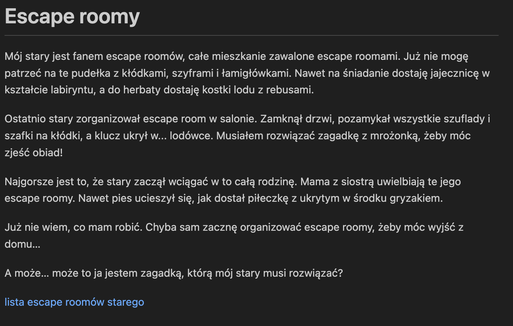
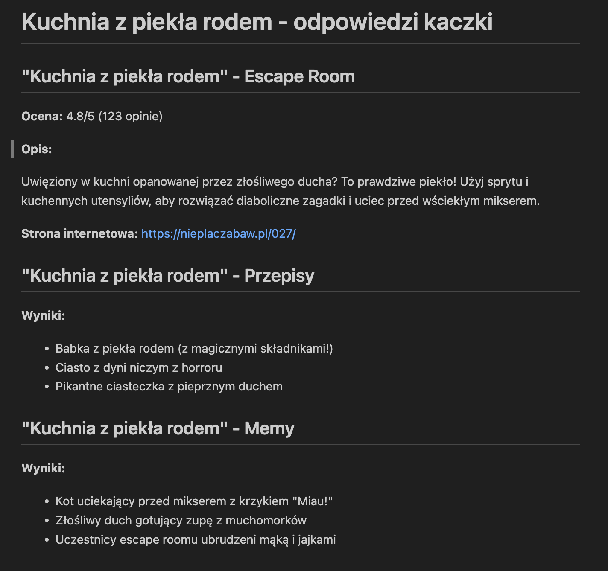

# Organizacyjne

Deadline: to zadanie jest na zaliczenie (TAK/NIE), trzeba je oddać na drugim lub trzecim laboratorium osobie, która prowadzi zajęcia.

To zadanie wymaga Pythona. Być może nie umiesz jeszcze Pythona w ogóle. Na końcu tej strony znajdziesz przydatne informacje.

# Zadanie

W tym zadaniu masz napisać program, który przygotuje statyczną witrynę internetową i wystawi ją "w internecie".

Precyzyjniej:
1. Należy napisać program, który ściągnie stronę internetową poświęconą jakiemuś wybranemu przez siebie tematowi, na przykład:
- TikTokerom ([https://www.favikon.com/blog/the-20-most-famous-tiktok-influencers-in-the-world](https://www.favikon.com/blog/the-20-most-famous-tiktok-influencers-in-the-world))
- językom programowania ([https://www.tiobe.com/tiobe-index/](https://www.tiobe.com/tiobe-index/))
- otwarciom szachowym ([https://chessfox.com/chess-openings-list/](https://chessfox.com/chess-openings-list/))

  **Ważna informacja**: strona ta powinna zawierać listę elementów, które można łatwo zescrapować (np. lista języków programowania, lista otwarć szachowych, lista tiktokowych influencerów), lista ta może być w formie tabeli, listy, itp.

2. Program ten powinien przetworzyć stronę internetową i wygenerować z niej plik w formacie markdown, który będzie zawierał listę elementów zescrapowanych z internetu wraz z jakimiś dodatkowymi informacjami (np. opis, link, obrazek, itp.)
3. Następnie należy (przy użyciu biblioteki w rodzaju [https://github.com/MarioVilas/googlesearch](https://github.com/MarioVilas/googlesearch), [https://github.com/deedy5/duckduckgo_search](https://github.com/deedy5/duckduckgo_search)) wyszukać w internecie dodatkowe informacje na temat każdego z elementów zescrapowanych z internetu.
4. Następnie należy przygotować witrynę internetową w formacie markdown, która będzie zawierała stronę statyczną, obrazki, dane zescrapowane z internetu (patrz punkt 2) i inne informacje, które uważasz za istotne.

## Witryna internetowa

Witryna powinna zawierać 

- co najmniej jedną stronę statyczną opisującą wybrany przez Ciebie temat
- listę zescrapowaną z internetu
- podstronę dla każdej z pozycji
 
## Wystawianie

Witryna powinna być wygenerowana przez [Jekylla](https://jekyllrb.com/) lub coś podobnego (np. [Hugo](https://gohugo.io/)).
Powinna być wystawiona na github.io lub na students.

Wystawianie na github.io jest opisane tutaj: [https://pages.github.com/](https://pages.github.com/)

## Przykład

Przykładowe zrzuty ekranu z witryny internetowej, którą przygotowałem na potrzeby tego zadania:

- strona główna: 
- strona z listą: 
- strona z elementem: 

## Dodatkowe uwagi

[https://docs.python.org/3/tutorial/](https://docs.python.org/3/tutorial/) to jest dobry tutorial do pythona.

Jeśli nie znasz się na Pythonie, to pewnie musisz zainstalować [środowisko wirtualne](https://packaging.python.org/en/latest/guides/installing-using-pip-and-virtual-environments/) w ten sposób nie zepsujesz sobie systemu operacyjnego. Nie rób `sudo pip install`!

W trakcie rozwiązywania trzeba też będzie ściągnąć strony z internetu i stworzyć własne strony w formacie markdown:

- [https://requests.readthedocs.io/en/latest/](https://requests.readthedocs.io/en/latest/)
- [https://aksakalli.github.io/jekyll-doc-theme/docs/cheatsheet/](https://aksakalli.github.io/jekyll-doc-theme/docs/cheatsheet/)

Możesz użyć dowolnych narzędzi do zescrapowania strony internetowej, ale musisz napisać własny program, który to zrobi. Mogą się tu przydać:
- [BeautifulSoup](https://www.crummy.com/software/BeautifulSoup/)
- Moduł [re](https://docs.python.org/3/library/re.html) z biblioteki standardowej Pythona (ale uwaga: HTML nie jest językiem regularnym i można się mocno zawieść)

